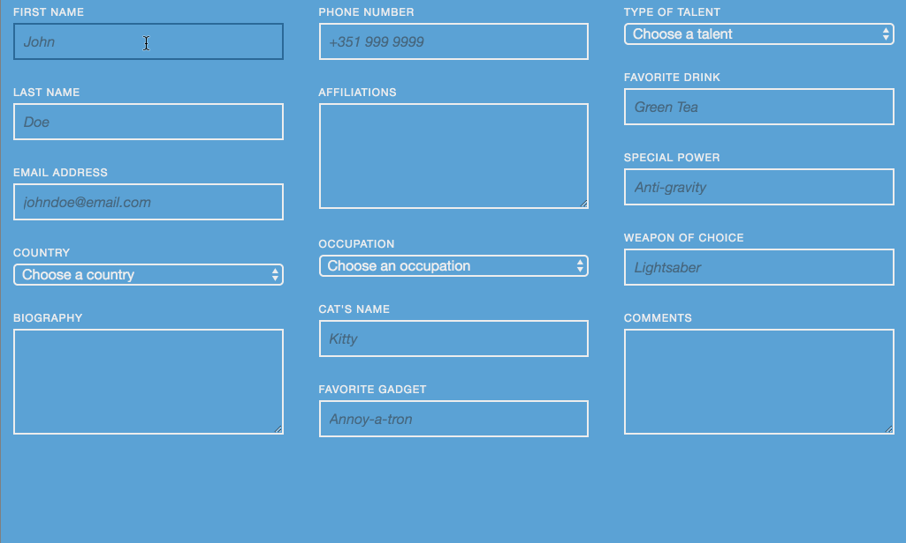

## You Should Know
- HTML
- CSS Layout
- Git Basics
- CSS Animations

## Your Mission

We'll duplicate a sample form from an animated image: 

### Explore Mode

**Challenge 1.1**: Apply your HTML form input knowledge by recreating the form from the image above.
**Goal 1.1**: An HTML file with a variety of input elements.

**Challenge 1.2**: Work with style & animations to give your form the same appearance and activity as our sample.
**Goal 1.2**: A CSS file with layout, colors & animations.

**Challenge 1.3**: Make sure your project is easy to review & share - upload it to Github Pages!
**Goal 1.3**: Submit your Github URL below.

### Adventure Mode
Make it responsive!

## Requirements for Completion
- A Github repository containing:
  - `index.html`
  - `styles.css`